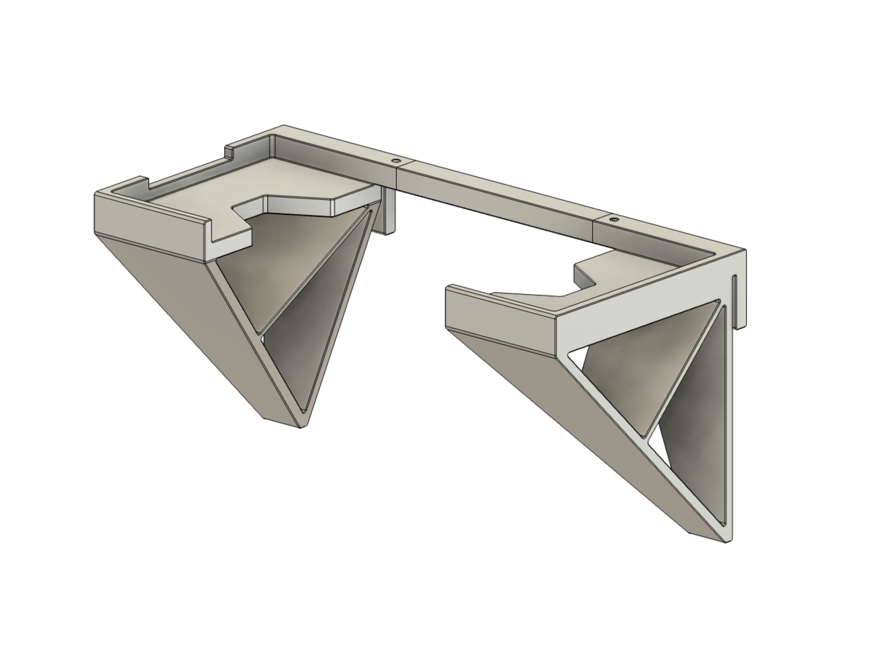
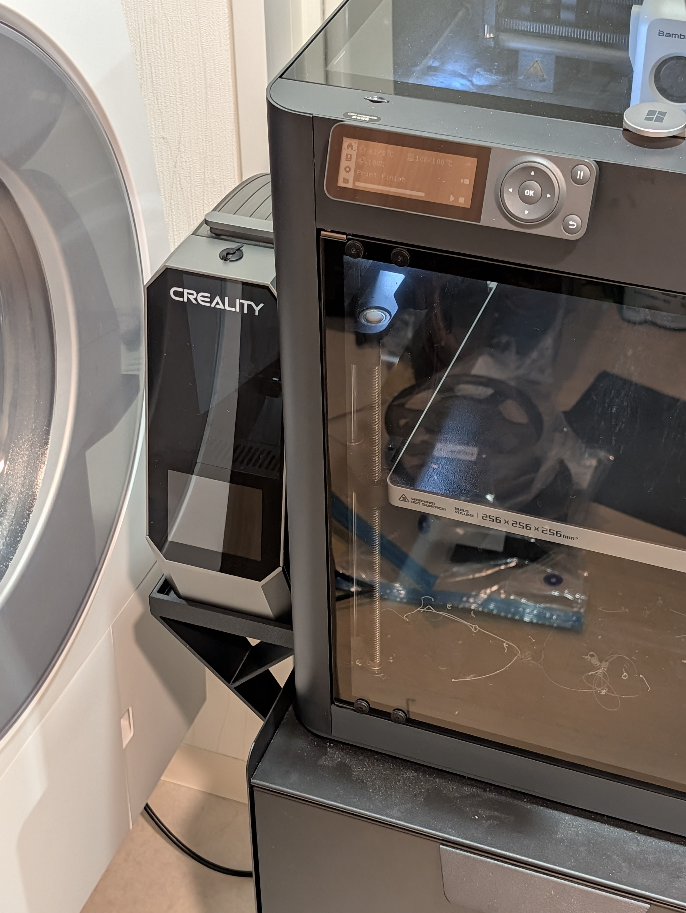
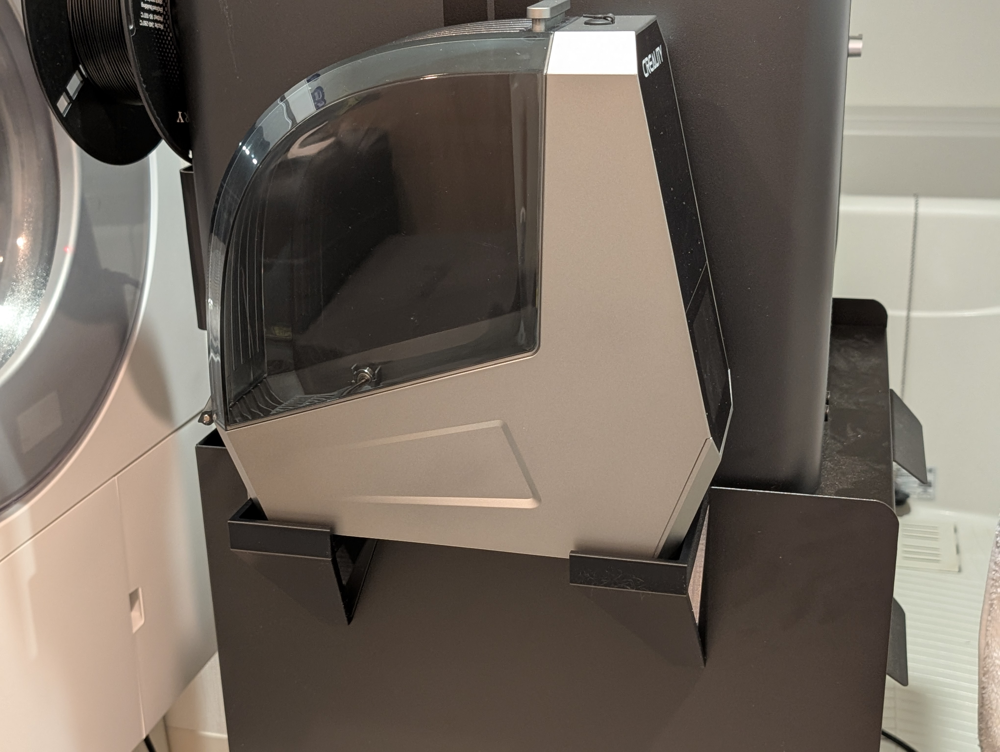

# Creality Space Pi Mount for Ikea Trotten Cart

A shelf to install the Creality Space Pi filament dryer along the ledge of an Ikea Trotten trolley cart.  
Fits alongside a Bambu P1S and likely a X1C.  

No adhesives required - simply hooks onto the ledge.  
Only the front and rear components are absolutely necessary; the spacer prevents the front/rear from sliding apart and is recommended for mostly-permanent installations.  
The front/rear and spacer can be fastened together after sliding together - use 2x M3 hex nuts and 2x M3x10 button head screws.  
**Do not lift the assembly with the spacer installed** - it is purely to prevent front-rear misalignment, and is not designed to be load-bearing.  

As with all of my other printer utilities and mods, this design relies on tight tolerances and dimensional accuracy.  
Always [calibrate your filament](https://github.com/ai03-2725/truss-3dp-shrinkage-util) - make sure pressure advance/flow dynamics/K-factor, flow rate, and shrinkage compensation are tuned for the filaments being used.  

As the Space Pi runs very warm, it is highly recommended to print the parts using ABS/ASA or some similarly heat-resistant material.  
Make sure that no seams are generated on the friction-fit areas - slight vertical indents are provided on all three parts for positioning a seam (i.e. with the OrcaSlicer/Bambu Studio seam painting tool) so that the seams do not generate unpredictably.  

Photos are from a non-final design copy - revised files fit the Space Pi with much smaller gaps.  