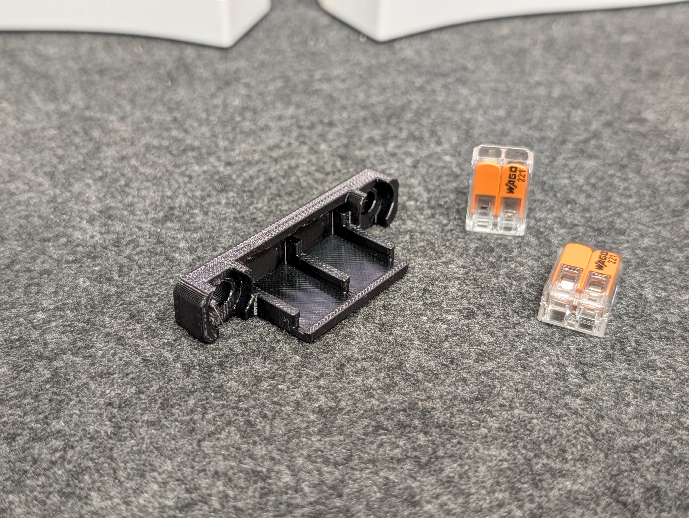
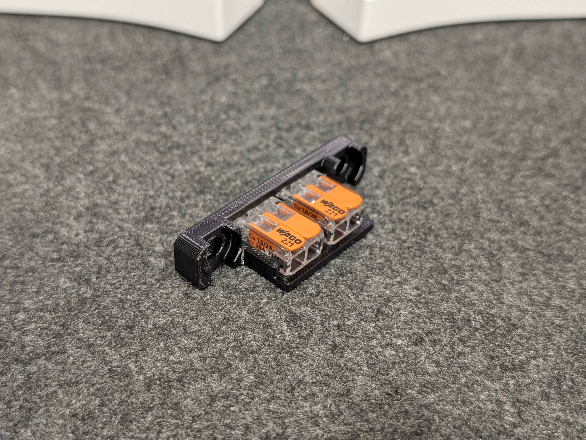
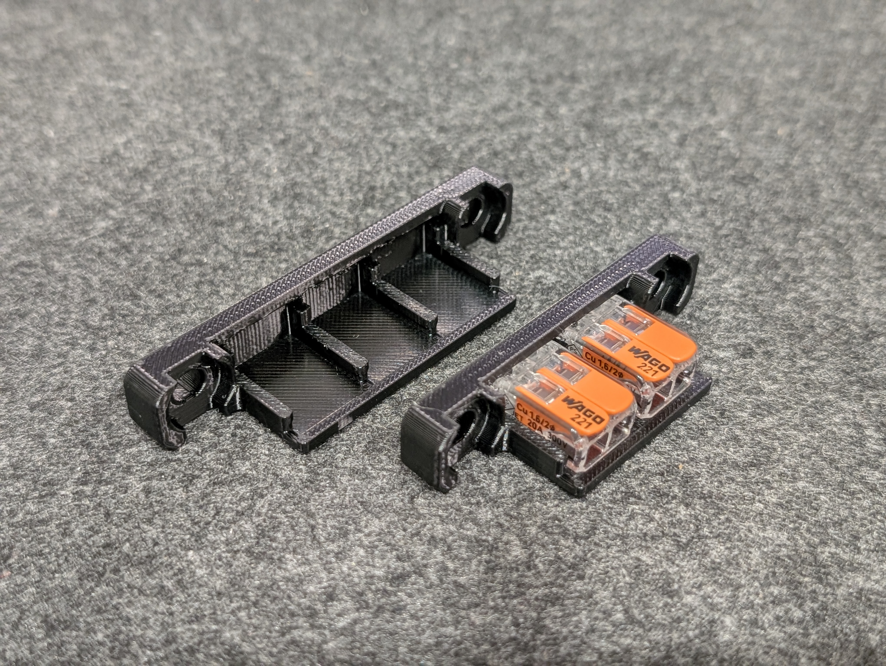

# Modified Voron Trident Bed Wago Mounts

A quick modification of the original Voron Trident under-bed Wago mounts to reduce bridging length for easier printing.  
A 2-connector variant has also been added for assisting with additional wiring (such as [under-bed fans](../Trident%204010%20Axial%20Bed%20Fans/) or similar).  

All credits for the original design go to the Voron team.  

## Note

The provided STLs are **not** scaled for shrinkage - please [calibrate your filament for shrinkage](https://github.com/ai03-2725/truss-3dp-shrinkage-util) as necessary.  

## Photos
Examples printed using CC3D PC (PC-PETG blend) to better withstand high temperatures close to the bed heater.  

