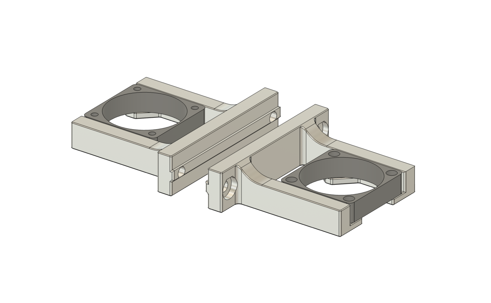
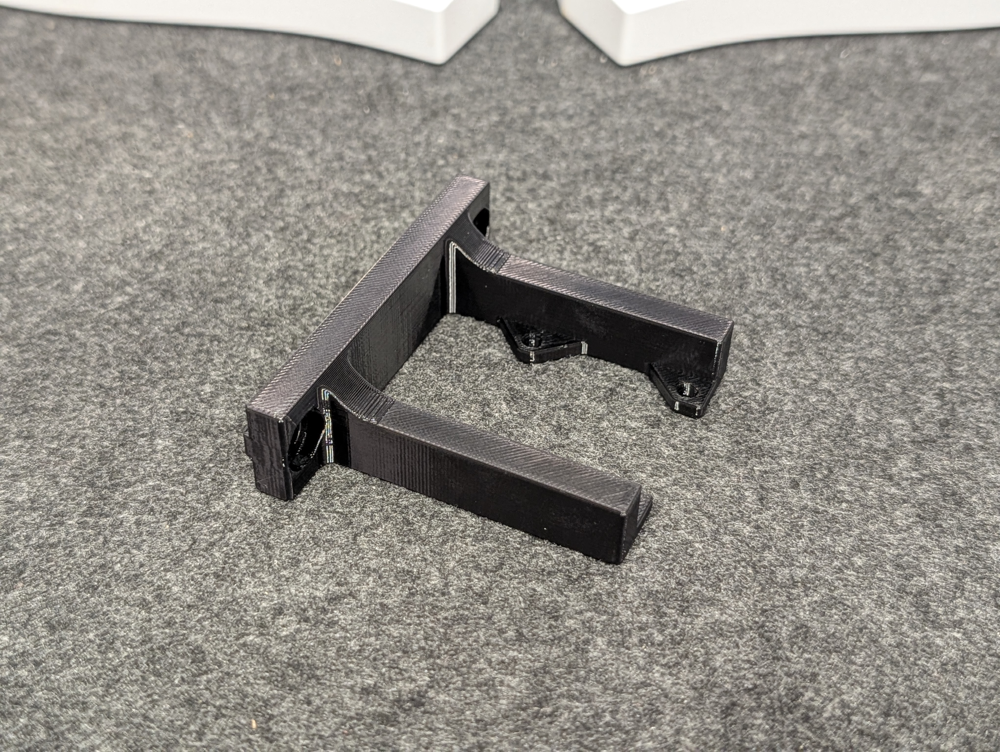
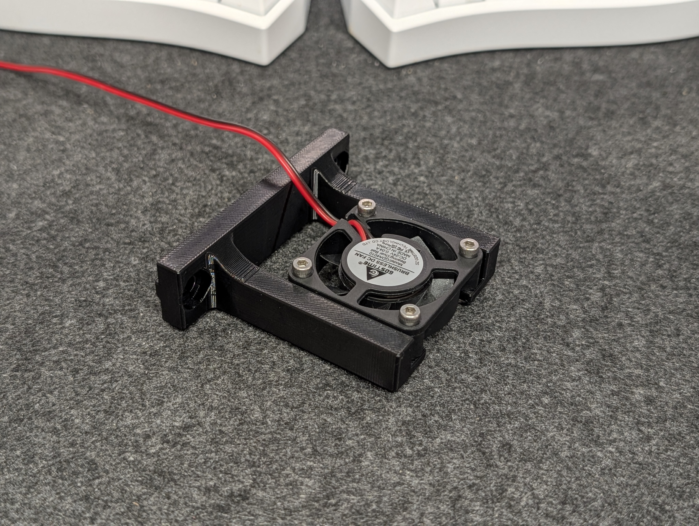

# Trident 4010 Axial Bed Fan Mount

A simple mounting bracket to install 4010 axial fans below the Voron Trident heated bed.  
Designed to be quite robust to hopefully withstand the sheer heat of the bed heater without drooping.  
Install with M5x10 + M5 T-nuts into the bed extrusions.  
  
Two variants are provided - a large hole variant for tapping screws (mainly for 4cm fans designed for PCs), and a small hole variant for M3 screws (mainly for 40mm fans designed for industrial use).  
Please measure your fan screw hole sizes to pick the variant desired.  

## Note

The provided STLs are **not** scaled for shrinkage - please [calibrate your filament for shrinkage](https://github.com/ai03-2725/truss-3dp-shrinkage-util) as necessary.  

## Printed Example
GDSTIME 4010 fans mounted to the M3 variant using M3 screws and nuts.   
Printed using CC3D PC (PC-PETG blend) to better withstand high temperatures close to the bed heater.  

