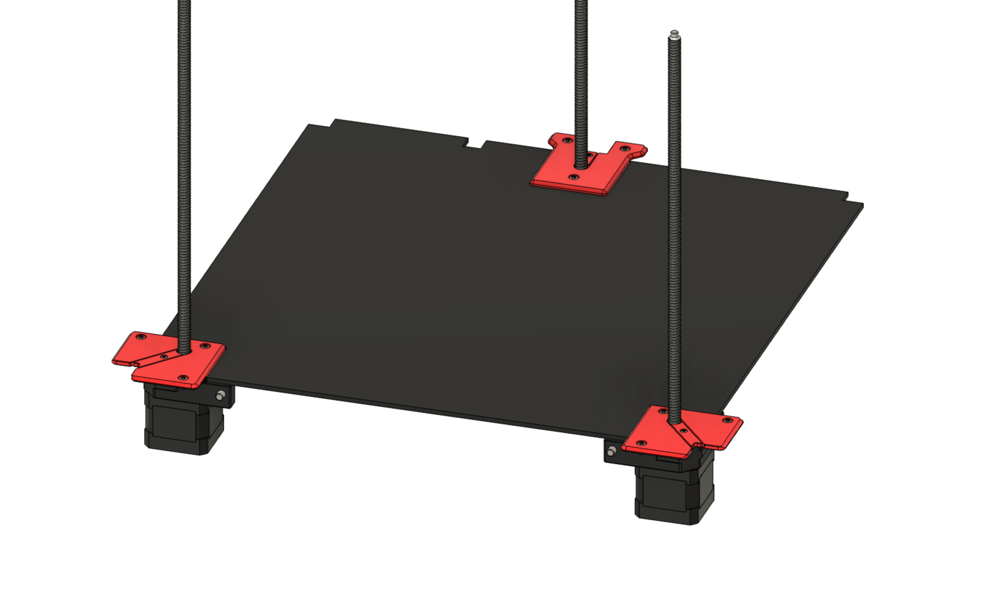

## Currently untested - use at your own risk.  

# Trident R2 Inverted Electronics Z Covers

This mod adapts the [Inverted Electronics Mod by LoganFraser](https://github.com/VoronDesign/VoronUsers/tree/main/printer_mods/LoganFraser/TridentInvertedElectronics) to the Trident R2 design.

The only adjustments made to make the panel removable with the stock Z motor mounts are the covers (`[a]_z_cover_left`, `[a]_z_cover_right`, and `[a]_z_cover_rear`).  
Please print stock parts for the rest of the Z motor mount assemblies.  
When installing, the extrusion M3 nuts for the rear cover will need to be moved closer together if coming from the stock covers.  

For the actually inverting the electronics bit, use the C-shaped DIN rail mounts from the above-linked inverted electronics mod.  

## Note

The provided STLs are **not** scaled for shrinkage - please [calibrate your filament for shrinkage](https://github.com/ai03-2725/truss-3dp-shrinkage-util) as necessary.  

## Credits

- Voron team for original design
- LoganFraser for original R1 inverted electronics mod