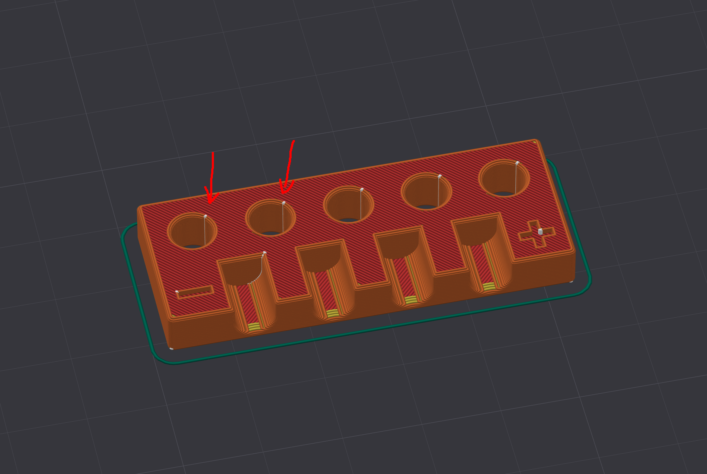
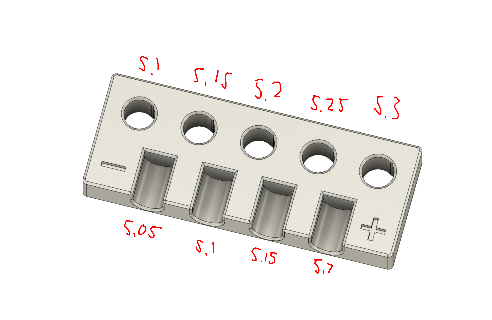
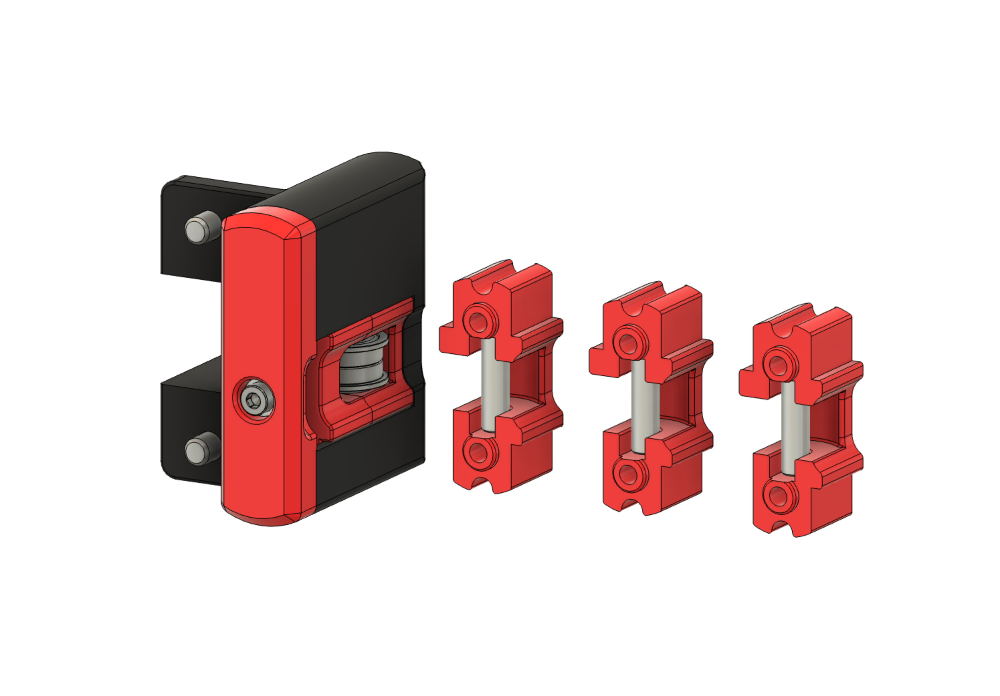
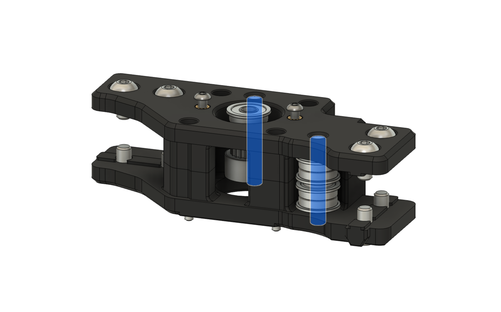
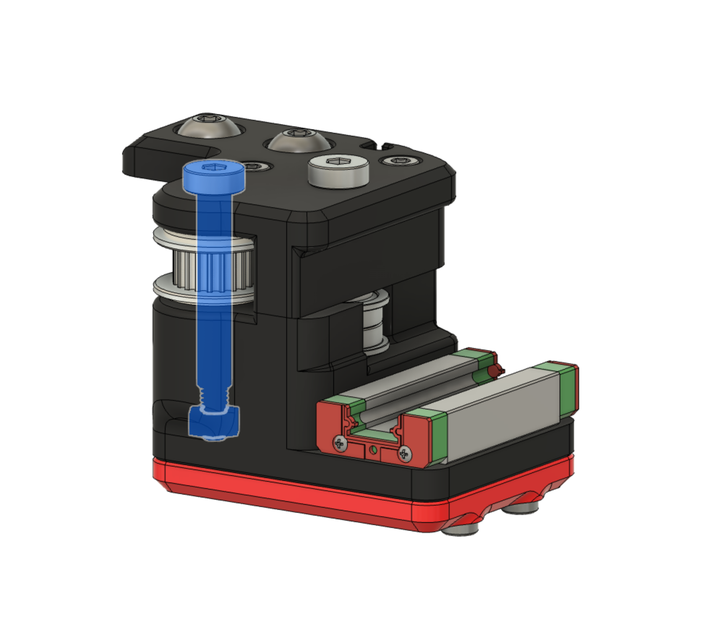
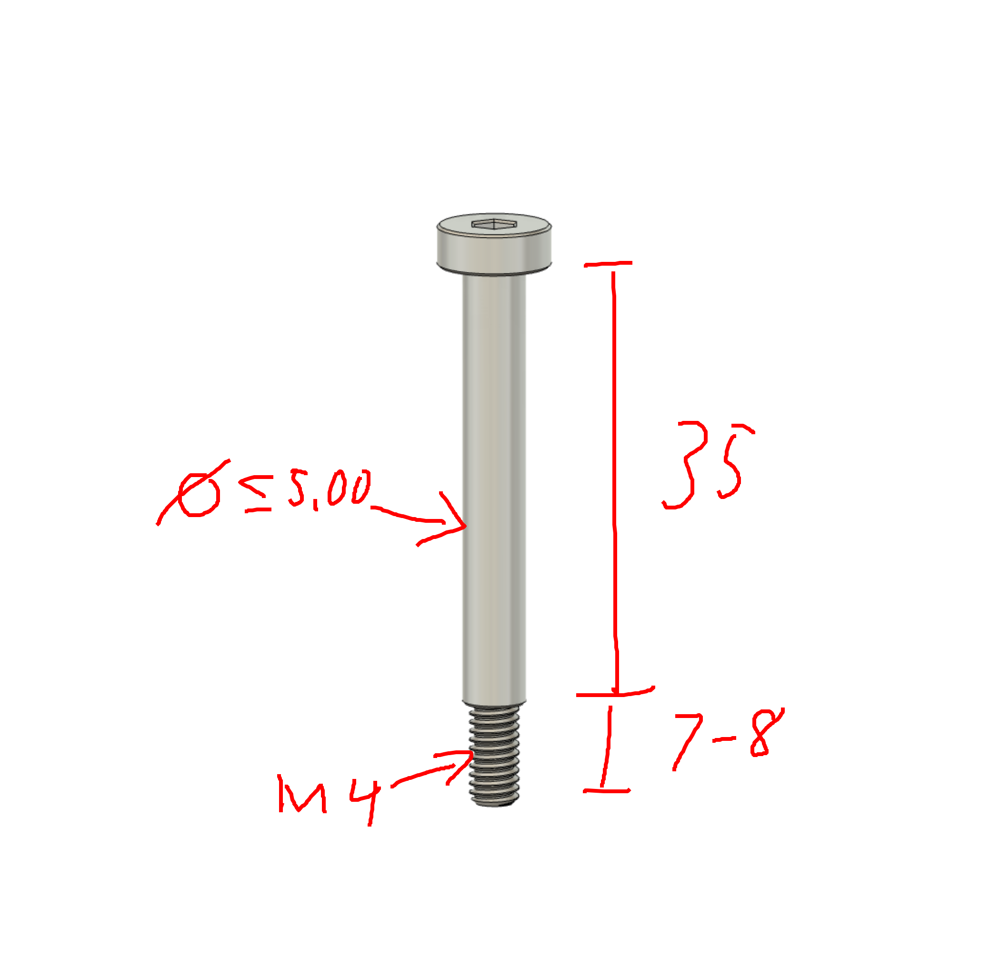

## Currently untested - use at your own risk.

 
 

# Trident R2 Pin Mod
This mod replaces the bearings-over-screw-threads in the A/B mounts, X/Y joints, and front idlers with pins or shoulder screws.  

 
 

# Filament Preparations
As the design relies heavily on tight tolerances, no pre-scaled files are provided.  
Instead, first [calibrate your filament](https://github.com/ai03-2725/truss-3dp-shrinkage-util) - make sure pressure advance/flow dynamics/K-factor, flow rate, and shrinkage compensation are tuned for the filaments being used.  

# Fitment Testing
Next, print the provided pin fitment tester tool with the calibrated production print settings.  
Place the seams in the provided seam escapement teardrops for vertical holes (for example using the seam painter in OrcaSlicer) - this prevents seam protrusions from unpredictably changing hole diameters.  

Test the pins and screws you will be using to find which hole diameter variant to print - the pins should hold firmly and not be loose, but also not be so tight as to deform or damage the printed part.  
The tester provides testing holes for vertical holes (A/B/X/Y) and horizontal holes (front idlers).

  
# Exporting STLs
Open the STEP files, export the desired parts as STL.  
Pick the variant with the hole sizes found to work best in the preparation step (vertical for A/B/X/Y, horizontal for front idler).

# Printing the Production Parts
Use the same settings as used earlier for the hole fitment test - make sure to place the seams in the escapement areas as necessary for vertical holes.  

 
 

# Front Idler

### Modified Parts
- `[a]_idler_carrier_a_x2`  
  Four different models are provided (Stock 5.20mm gap, narrower 5.15/5.10/5.05 gap).

### BOM Changes
- 1x M5x16 BHCS -> 1x 5x18mm pin (per idler)

 
 

# A/B Drives

### Modified Parts
- `a_stepper_upper`
- `a_stepper_lower`
- `b_stepper_upper`
- `b_stepper_lower`
  For the above four parts, five different models are provided (5.10/5.15/5.20/5.25/5.30 holes for the shoulder screw).

### BOM Changes
- 2x M5x30 BHCS -> 2x 5x30mm pin (per each drive)
- No longer need 2x M5 heat-set inserts (per each drive)

 
 

# X/Y Joints

This modification uses shoulder screws instead of pins to maintain the necessary force pulling the upper and lower portions together instead of putting all of the strain on just two M3 screws.  

### Modified parts
- `xy_left_upper`
- `xy_left_lower`
- `xy_right_upper`
- `xy_right_lower`
  For the above four parts, five different models are provided (5.10/5.15/5.20/5.25/5.30 holes for the shoulder screw).
- `[a]_xy_left`
- `[a]_xy_right`, `[a]_xy_right_D2F`

### BOM Changes
- 2x M5x30 BHCS -> 2x 5x35mm+M4 shoulder screw (per each drive)
- 2x M5 heat-set inserts -> 2x M4 hex nuts (per each drive)

Note: I've also made a [simplified X/Y joint](../Trident%20R2%20Simplified%20XY%20Joints/) mod which uses the same shoulder screws.  

 
 

# Hardware Specs
- The pins should be *maximum* 5.00mm diameter pins - if the tolerances allow for deviations to larger than 5.00mm, the pins will be too large to fit through the bearings/idlers.
  - Possible sources: [This](<https://aliexpress.com/item/33003800129.html>) (I've used this listing for pin modding in the past; it works albeit too tight of a fit sometimes), [this](<https://aliexpress.com/item/1005005710466043.html>), any other known source for pin mod pins
- The shoulder screws used in the X/Y joint design should be as follows:
  - Column diameter 5mm (make sure tolerances do not allow deviations to larger than 5.00mm), length 35mm
  - Threaded portion M4, length anywhere between 7 and 9mm
    
  - Possible sources: [This](<https://aliexpress.com/item/1005008314417915.html>), [this](<https://aliexpress.com/item/1005011951370324.html>)

 
 

# Credits

- Voron Team for the original Trident R2 design
- [hartk1213's R1 Trident pin mod design](https://github.com/VoronDesign/VoronUsers/tree/main/printer_mods/hartk1213/Voron2.4_Trident_Pins_Mod) which inspired this mod