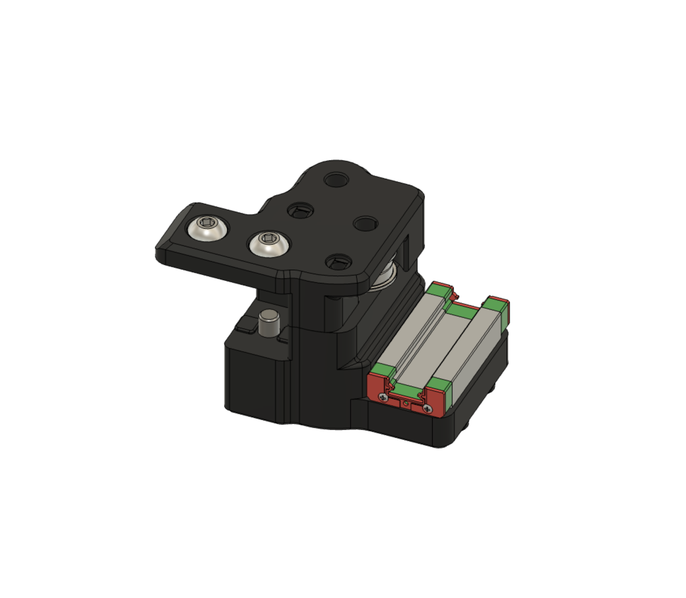
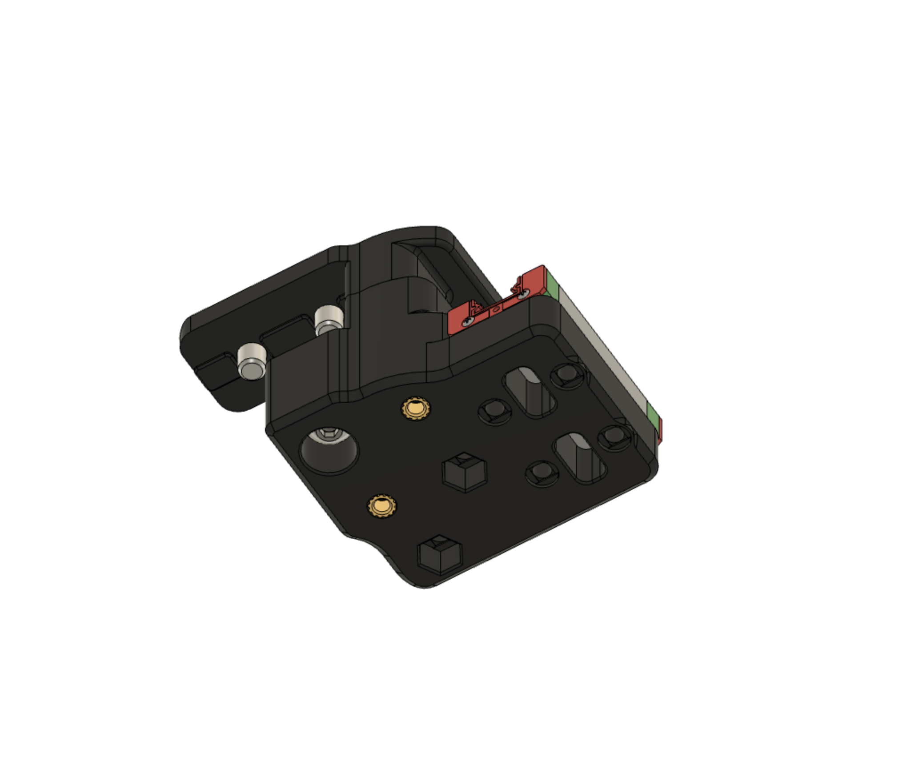

## Currently untested - use at your own risk.

# Trident R2 Simplified X/Y Joints

Made for myself.  
- M5 screws for bearings/idlers replaced with shoulder screws (column D5xL35 + threaded M4x8) - effectively a pin mod while retaining the ability to pull the upper/lower halves together with screw tension
- M5 heat-set inserts replaced with M4 hex nuts
- M3x40 socket head screws replaced with M3x45 button head screws
- Bottom cover section removed entirely and merged into lower half for single-part robustness and simplicity
- Removed bottom D2F variants - intended for sensorless homing

More or less a simplified version of the XY joints in the [pin/shoulder screw mod](../Trident%20R2%20Pin%20Mod/).  
Print instructions and sourcing info are more or less the same as well.  